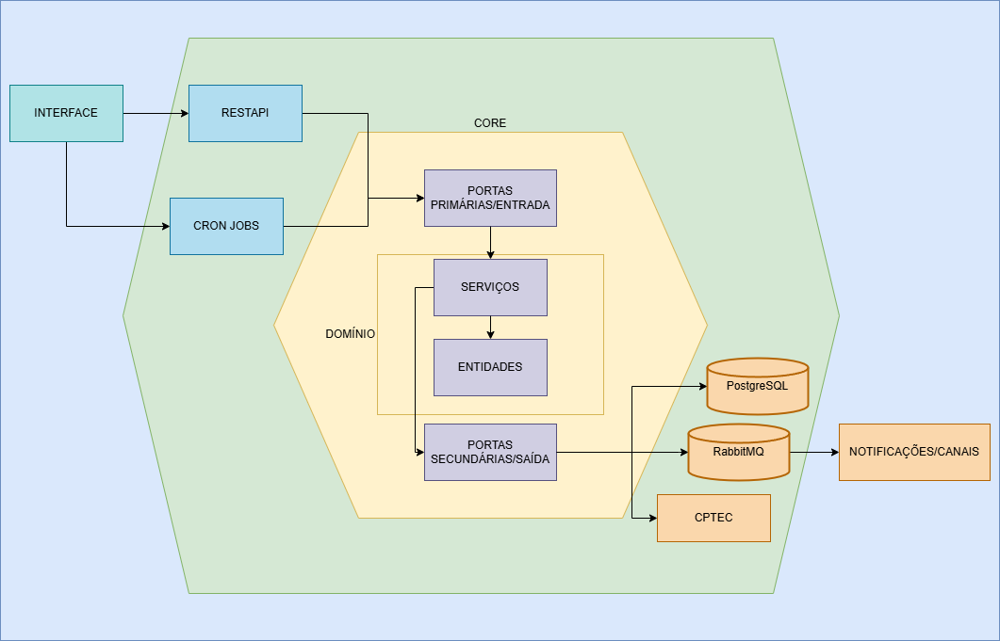

# API DE NOTIFICAÇÃO SOBRE O CLIMA

API desenvolvida com o intuito de oferecer um serviço de agendamento de notificações sobre o clima e o tempo.

## Arquitetura

O projeto segue uma arquitetura hexagonal (também conhecida pelo conceito de portas e adaptadores) para manter o domínio da aplicação isolado e independente de tecnologias externas. E levando também em consideração a pretenção de inclusão de diversos canais de notificação, esse tipo de arquitetura facilitaria a implementação.

### Estrutura da Arquitetura

- **Adaptadores Primários**: Serão os "startes" da aplicação
- **Core**: Possui as lógicas/regras de negócio
  - Portas: Interfaces que definem os contratos (implementações a serem realizadas)
  - Domínio: Serviços e entidades que implementam as regras de negócio
- **Adaptadores Secundários**: Implementações para serviços externos como a api do CPTEC e o RabbitMQ
  - PostgreSQL: Persistência de dados
  - RabbitMQ: Gerenciamento de filas e mensageria
  - CPTEC API: Serviço externo de previsão do tempo

## Principais Tecnologias

- Go 1.23
- PostgreSQL
- RabbitMQ
- Docker
- Docker Compose

## Configuração

### Pré-requisitos
- [Go 1.23+](https://go.dev/dl/)
- [Docker e Docker Compose](https://www.docker.com/)

### Instalação
1. Clone o repositório
2. Copie `.env.example` para `.env` e configure as variáveis
3. Execute: `docker-compose up -d`

## API

### Autenticação
Todas as rotas requerem o header `Authorization` com um token válido. Que pode ser obtido ou configurado através da env API_TOKEN

### Endpoints

#### Usuários
- `POST /api/users` - Criar usuário
- `PUT /api/users/{id}` - Atualizar usuário
- `PATCH /api/users/{id}/optout` - Atualizar opt-out
- `GET /api/users` - Listar usuários

#### Notificações
- `POST /api/notifications` - Agendar notificação
- `GET /api/notifications` - Listar notificações do usuário

#### Clima
- `GET /api/weather/search` - Buscar cidade
- `GET /api/weather/forecast` - Buscar previsão

#### Notificações Globais
- `POST /api/notifications/global` - Criar notificação global
- `GET /api/notifications/global` - Listar notificações globais

### Documentação
Acesse a documentação completa da API em `/swagger/index.html`

## Acessando Interfaces

#### RabbitMQ
- URL: http://localhost:15672
- Usuario: teste (conforme configuração)
- Senha: teste (conforme configuração)

A interface permite monitorar as filas e mensagens